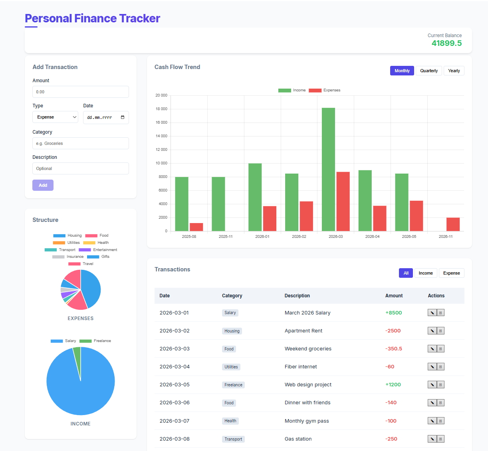

# Personal Finance Tracker

A modern, full-stack web application designed to help users track their income and expenses, visualize financial trends, and manage their budget effectively.



## Tech Stack

### Backend
- Java 17
- Spring Boot 3
- Spring Data JPA (Hibernate)
- PostgreSQL (Production-ready database)
- Maven (Dependency management)

### Frontend
- Angular 17+
- TypeScript
- Chart.js & ng2-charts (Data visualization)
- Reactive Forms (Input validation)
- CSS3 (Custom modern dashboard UI)

### Infrastructure
- Docker & Docker Compose (Database orchestration)

## Key Features

- Full CRUD Operations: Add, view, edit, and delete transactions.
- Dynamic Balance: Real-time balance calculation based on your history.
- Financial Visualization:
  - Pie Charts: Breakdown of expenses and income by category.
  - Bar Charts: Cash flow trends with Monthly, Quarterly, and Yearly views.
- Advanced Filtering: Filter transactions by type (Income/Expense) to drill down into data.
- Responsive Design: Modern dashboard optimized for different screen sizes.
- Persistent Storage: Data is safely stored in a PostgreSQL database running in a Docker container.

## Getting Started

### Prerequisites
- Docker Desktop
- Java 17 JDK
- Node.js & npm
- Angular CLI

### Installation and Setup

1. Clone the repository

```bash
git clone [https://github.com/MarcinTyszka/personal-finance-tracker.git](https://github.com/MarcinTyszka/personal-finance-tracker.git)
cd personal-finance-tracker
```

2. Start the Database (Docker)

```bash
docker-compose up -d
```

3. Run the Backend

```bash
cd backend
./mvnw spring-boot:run
```

4. Run the Frontend

```bash
cd frontend
npm install
npm start
```

5. Access the App
Open your browser and navigate to http://localhost:4200